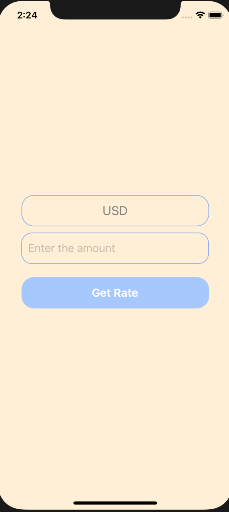
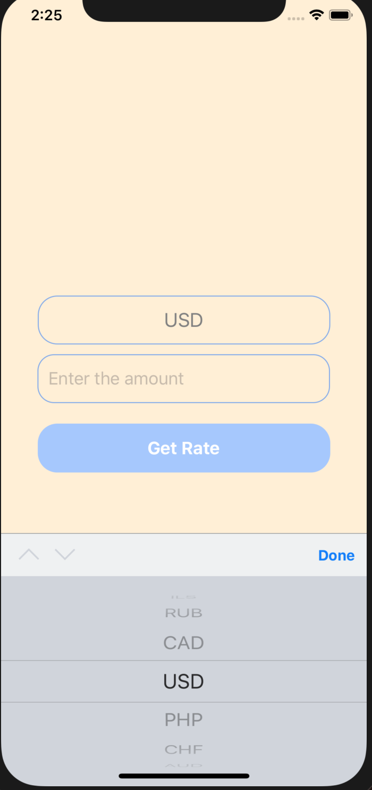
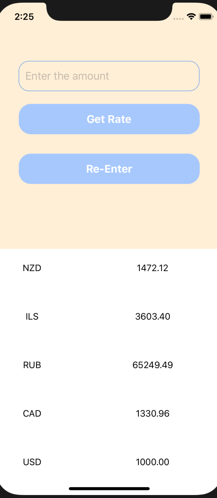
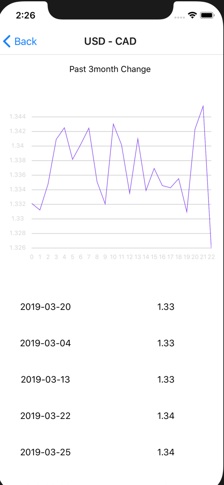

## Project Title
Checking currency

## Motivation
It is part of Interview projects which should use React context API

## Images
 

   
   
   
   
 

 
## Tech and Framework
Built with
 - Expo
 - React-Navigation
 - React-Native-SVG-Charts
 - Styled-Components
 - React-Native-picker-select

## Installation
npm i

